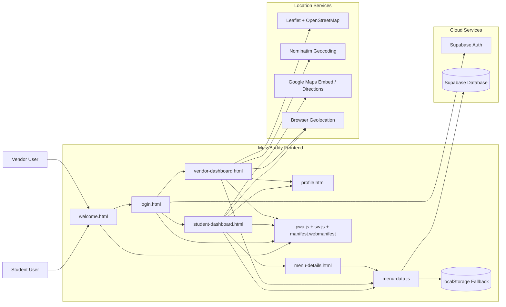
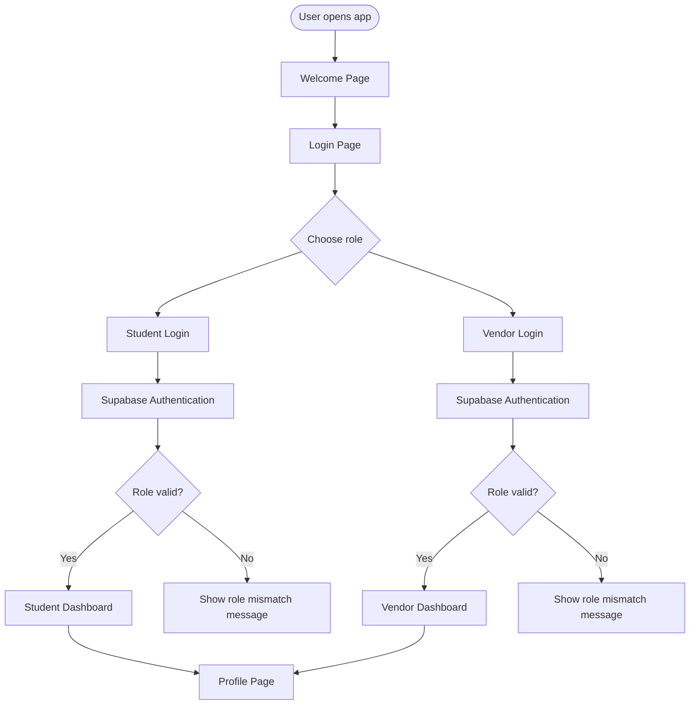
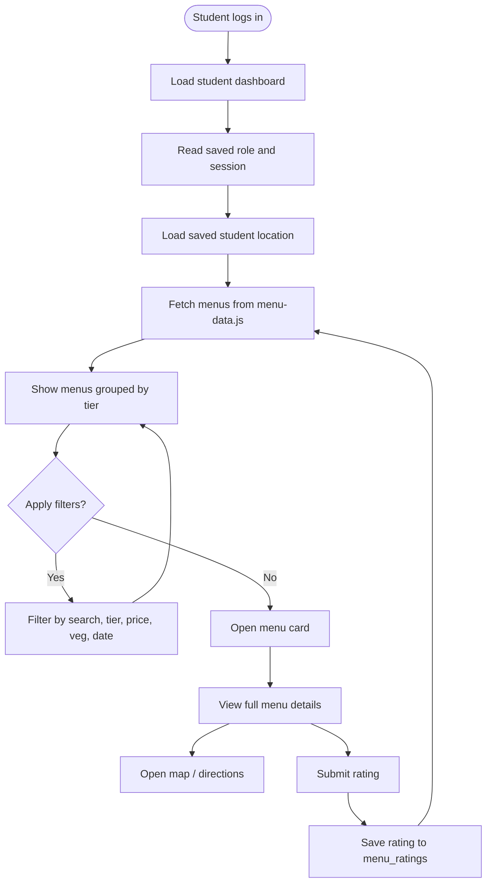
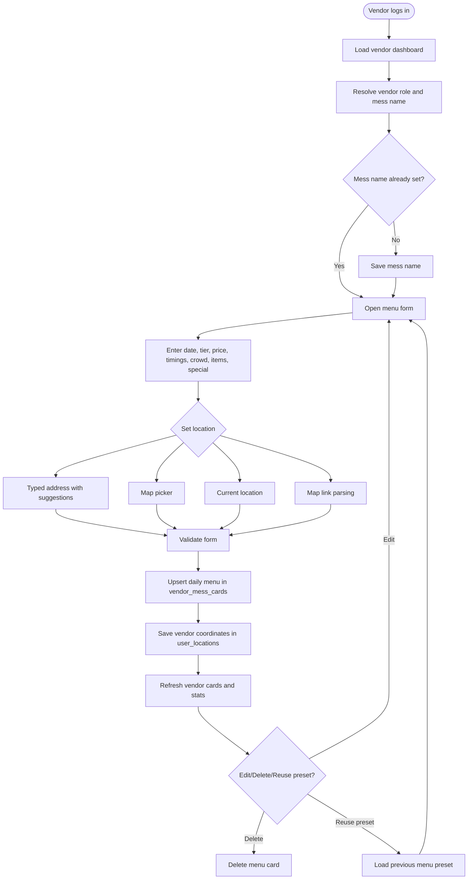
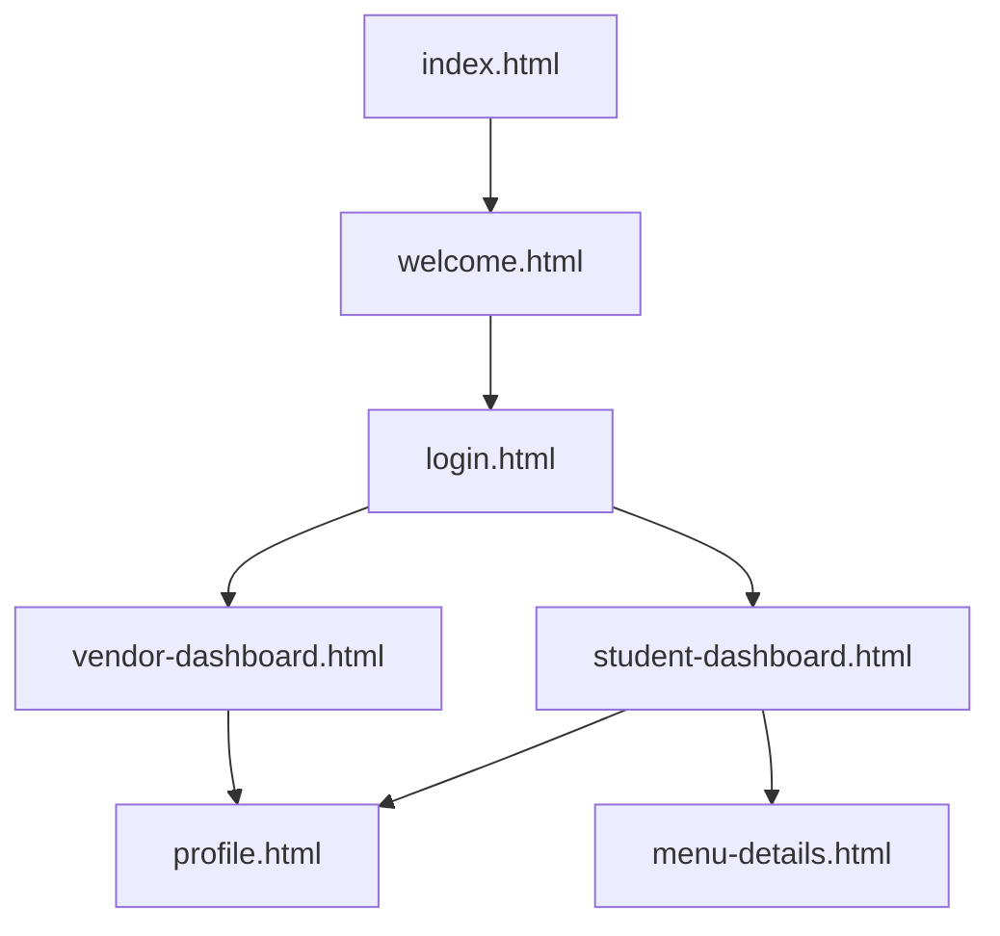
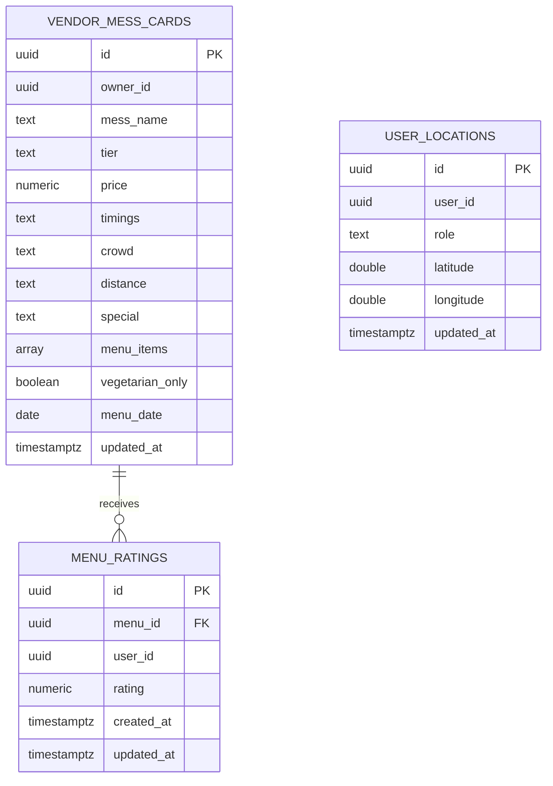
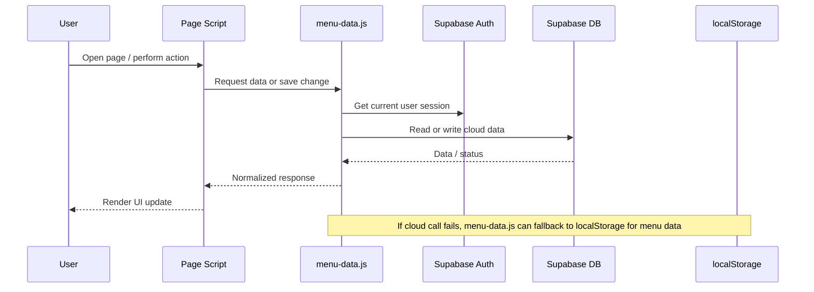
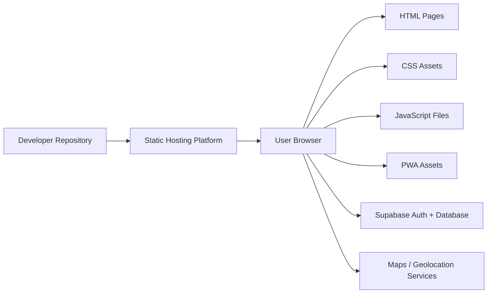

# MessBuddy Diagrams

This file contains project diagrams for MessBuddy in Mermaid format so they render directly on GitHub and in Mermaid-compatible Markdown viewers.

## 1. System Architecture

## 2. Role-Based Login Flow

## 3. Student User Flow

## 4. Vendor User Flow

## 5. Page Navigation Diagram

## 6. Data Model / ER Diagram

## 7. Data Access Flow

## 8. Deployment Diagram

